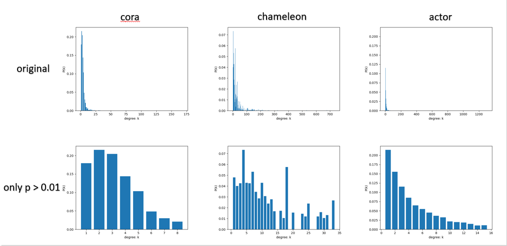
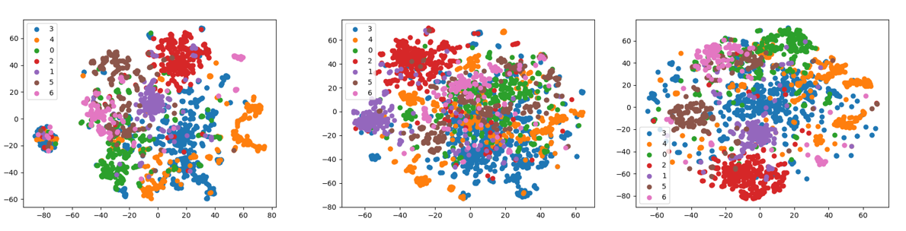
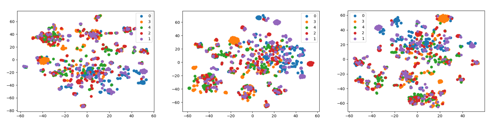
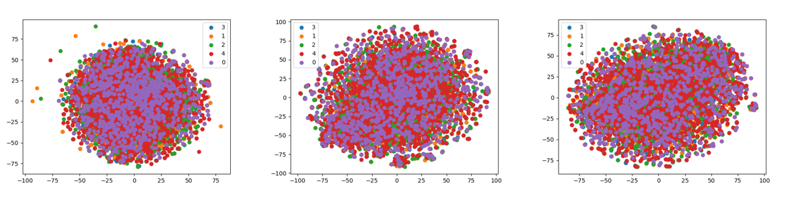

# GML-DM-hw1
Graph machine learning and data mining, homework1

成员：江彦泽、俞越、陈励

该README最后会作为报告提交，报告中包括：
- 详细的实验过程
- 遇到的问题和解决方案
- 最后得到的分析性数据结果或结论

环境信息：
- 操作系统：Windows 10
- Python: 3.8.8
- PyTorch: 1.10.0 py3.8_cpu_0
- PyG: 2.0.2 py38_torch_1.10.0_cpu
- tensorflow: 2.3.0
- gensim: 3.6.0


## 任务一 网络数据分析
> 运行degree_analysis.py即可得到第一部分的结果

对比分析给定的三个不同数据集的性质
- 图的平均节点度数；
- 画出度分布直方图，横轴k代表度的取值，纵轴P(k)代表任取结点度数为k的概率；
- 图的平均节点聚集系数；

### 1.1 读取数据
> 详细代码见：degree_analysis.py 的 read_dataset_from_file 函数

我们使用PyG完成任务，因此，需要将数据读入torch_geometric.data.Data中 

首先，我们读取edge_list.txt文件，读取边的信息 "edge_index"。

然后，我们需要读取feature.txt文件，将node的特征信息 "x" 读入dataset，这个信息虽然不会在任务一中用到，但之后的任务中可能需要使用。

最后，我们将edge的信息 "edge_index" 和节点的feature信息 "x"作为参数传入torch_geometric.data.Data，构造出待使用的数据集。

### 1.2 图的平均节点度数
> 详细代码见：degree_analysis.py 的 cal_avg_degree 函数

设图的边数为E，节点数为V，则：
- 无向图平均度数计算公式为：2*E / V
- 有向图的平均度数公式为：E / V

这次任务给的数据都是无向图，edge_list中的数据都是以有向图的形式出现的，
所以我们要直接使用E / V来计算结果。

**计算结果如下**:
```
dataset/cora's average degree is 3.8980797636632203
dataset/chameleon's average degree is 27.55467720685112
dataset/actor's average degree is 7.015526315789474
```

### 1.3 画出度分布直方图
> 详细代码见 degree_analysis.py 的 draw_degree_distribution_histogram 函数

其思路为，先算出每个点的度数，然后统计每个度数出现的次数，最后画出频率分布直方图。最终得到的度分布直方图如下：

上面一行`original`指的是不做任何处理的概率分布直方图，但由于一些边缘数据取到的概率本就不大，因此做了一个展示上的优化，
取P > 0.01的数据画了第2行图。现在代码的运行结果就是第2行图。

### 1.4 计算平均节点聚集系数
> 详细代码见 degree_analysis.py 的 get_adjacency_matrix 和 cal_avg_clustering_coefficient函数

首先，我们要将数据中的edge信息存入邻接矩阵，为此我写了get_adjacency_matrix函数来完成这个任务。

然后，就是cal_avg_clustering_coefficient函数中的内容了。对于每个node，找到它的全部相邻节点，并将其存入neighbor_nodes_list。该列表的长度就是
该node的degree，对于degree <= 1的数据，我们不予考虑。而当degree >= 2时，我们通过之前得到的邻接矩阵adj_matrix，查看neighbor_nodes_list
中的数据是否两两有edge相连，我们要统计其edge的数量，记作neighbor_links_cnt。最后通过公式
```
clustering_coefficient = 2 * neighbor_links_cnt / (degree * (degree - 1))
avg_clustering_coefficient = sum(clustering_coefficient) / |V|
```
算得avg_clustering_coefficient。**最后得到的结果为**：
```
dataset/cora's average clustering coefficient is 0.24067329850193728
dataset/chameleon's average clustering coefficient is 0.48135057608791076
dataset/actor's average clustering coefficient is 0.08019255113574139
```

## 任务二 浅层模型
> 运行node_embedding.py即可获得第二部分的全部结果
> 但是可能会很慢，瓶颈在于LINE，建议改小LINE的epoch，或者选用first/second-order
### 2.1 实现DeepWalk, Node2Vec, LINE
参考 https://github.com/shenweichen/GraphEmbedding 的实现方式（源代码根据MIT协议开源），复制了其ge部分。

#### 2.1.1 DeepWalk
DeepWalk参考了Word2Vec的思路，因此，在完成随机游走（详细代码见walker.RandomWalker）后，我们可以直接借用gensim.models.Word2Vec来完成训练。

#### 2.1.2 Node2Vec
Node2Vec和DeepWalk的最区别在于对node序列的采样，它不是随机抽取相邻节点，而是按照p, q的概率进行抽取。p控制访问之前节点的概率，q允许随机游走区分“向内”
和 “向外”节点。

而采样完成后，后面的过程和DeepWalk类似

#### 2.1.3 LINE
论文中给出了两种相似度定义，其中first-order proximity只能用于无向图，用于描述顶点之间是否存在直连边。而second-order proximity
用于描述顶点之间是否存在相似的邻居顶点。

三个算法的对比会放在最后，这里我们像论文一样，对比LINE(1st), LINE(2nd), LINE(1st+2nd)的效果

数据集选择：Cora, 参数选择：词向量维度 = 128, epochs = 50, batch_size=1024
##### 结果如下
| | Micro-f1 | Macro-f1 | Samples-f1 | Weighted-f1 | acc |
| --- | --- | --- | --- | --- | --- |
| LINE(1st) | 0.6942 | 0.6847 | 0.6942 | 0.6924 | 0.6942 |
| LINE(2nd) | 0.7112 | 0.7002 | 0.7112 | 0.7099 | 0.7112 |
| LINE(1st + 2nd) | 0.7496 | 0.7277 | 0.7496 | 0.7483 | 0.7496 |

可以看出，基本上满足论文中的结果，LINE(1st + 2nd)的分类效果最优

### 2.2 结果展示
#### 2.2.1 参数选择
词向量维度均为128

DeepWalk: 每个顶点的游走路径数 = 50, 游走路径长度 = 20, Epoch = 5, 窗口大小w = 10

Node2Vec: p = 0.25, q = 0.25, 其余参数与DeepWalk一致

LINE: Epoch = 150, batch_size=1024, loss为1st+2nd

#### 2.2.2 embedding 结果
我们使用TSNE将得到的128维向量降维到2维，然后将其画出，可以看出，相同的颜色代表同类，基本都在相近的区域，说明embedding保持了其相似性。

下图从左到右依次是 DeepWalk, Node2Vec, LINE的结果
##### Cora:


##### Chameleon


##### Actor

#### 2.2.3 分类结果
分类器采用sklearn的LogisticRegression，Metric选择：Micro-f1, Macro-f1, Samples-f1, Weighted-f1, acc

##### Cora: 
| | Micro-f1 | Macro-f1 | Samples-f1 | Weighted-f1 | acc |
| --- | --- | --- | --- | --- | --- |
| DeepWalk | 0.8358 | 0.8258 | 0.8358 | 0.8367 | 0.8358 |
| Node2Vec | 0.8247 | 0.8081 | 0.8247 | 0.8240 | 0.8247 |
| LINE | 0.7546 | 0.7343 | 0.7546 | 0.7534 | 0.7546 |

##### Chameleon
| | Micro-f1 | Macro-f1 | Samples-f1 | Weighted-f1 | acc |
| --- | --- | --- | --- | --- | --- |
| DeepWalk | 0.6250 | 0.6242 | 0.6250 | 0.6242 | 0.6250 |
| Node2Vec | 0.5789 | 0.5756 | 0.5789 | 0.5775 | 0.5789 |
| LINE | 0.6447 | 0.6445 | 0.6447 | 0.6448 | 0.6447 |

##### Actor
| | Micro-f1 | Macro-f1 | Samples-f1 | Weighted-f1 | acc |
| --- | --- | --- | --- | --- | --- |
| DeepWalk | 0.2184 | 0.1628 | 0.2184 | 0.1870 | 0.2184 |
| Node2Vec | 0.2112 | 0.1601 | 0.2112 | 0.1847 | 0.2112 |
| LINE | 0.2243 | 0.1845 | 0.2243 | 0.2077 | 0.2243 |

实验结果显示，总体上看 LINE embedding后的分类效果略好于DeepWalk和Node2Vec。而DeepWalk的结果要优于Node2Vec。这于Node2Vec的论文情况不太一致，
估计是由于参数选择导致的，而且总体上二者的结果比较接近，区别不大。